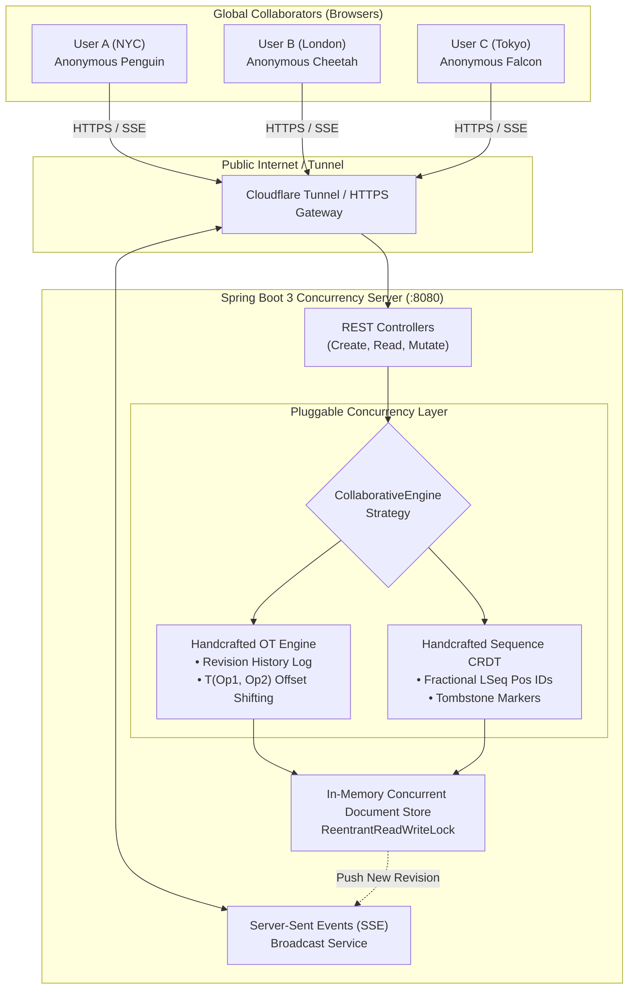

# Collaborative Google Docs System Design Prototype

A production-grade, educational prototype of **Google Docs** built for system design practice, featuring pluggable **Operational Transformation (OT)** and **Sequence CRDT (LSeq)** concurrency engines, and designed for **live multi-user global collaboration across the internet**.

---

## 🏛 System Architecture



---

## 🔌 The 3 Core APIs

### 1. Create Document & Session
- **Endpoint**: `POST /api/documents`
- **Description**: Creates a new document, provisions a unique session token, and returns a shareable document URL.
- **Request Body**:
  ```json
  {
    "title": "Distributed Consensus Notes",
    "engineType": "OT"
  }
  ```
  *(Options for `engineType`: `"OT"` or `"CRDT"`)*
- **Response (`201 Created`)**:
  ```json
  {
    "docId": "8b51d6c8-f463-4709-b1d5-866ce9aa1e92",
    "url": "/docs/8b51d6c8-f463-4709-b1d5-866ce9aa1e92",
    "sessionId": "sess-a1b2c3d4-e5f6-7890",
    "title": "Distributed Consensus Notes",
    "engineType": "OT",
    "content": "",
    "revision": 0,
    "user": {
      "sessionId": "sess-a1b2c3d4-e5f6-7890",
      "displayName": "Anonymous Penguin",
      "color": "#3b82f6"
    }
  }
  ```

### 2. Read Document by URL / ID
- **Endpoint**: `GET /api/documents/{docId}`
- **Headers**: `X-Session-Id: sess-...` (optional; registers new peer if missing)
- **Response (`200 OK`)**:
  ```json
  {
    "docId": "8b51d6c8-f463-4709-b1d5-866ce9aa1e92",
    "title": "Distributed Consensus Notes",
    "engineType": "OT",
    "content": "Paxos and Raft consensus algorithms...",
    "revision": 4,
    "activeUsers": [
      { "sessionId": "sess-1", "displayName": "Anonymous Penguin", "color": "#3b82f6" },
      { "sessionId": "sess-2", "displayName": "Anonymous Cheetah", "color": "#10b981" }
    ]
  }
  ```

### 3. Operations on the Document (Edit, Insert, Remove)
- **Endpoint**: `POST /api/documents/{docId}/operations`
- **Request Body**:
  ```json
  {
    "sessionId": "sess-a1b2c3d4-e5f6-7890",
    "baseRevision": 4,
    "type": "INSERT",
    "position": 5,
    "text": " distributed",
    "length": 0
  }
  ```
- **Operation Types**:
  - `INSERT`: Inserts `text` at character offset `position`.
  - `DELETE`: Removes `length` characters starting at `position`.
  - `REPLACE`: Replaces `length` characters at `position` with `text`.
- **Response (`200 OK`)**:
  ```json
  {
    "success": true,
    "docId": "8b51d6c8-...",
    "engineType": "OT",
    "revision": 5,
    "position": 5,
    "text": " distributed",
    "content": "Paxos distributed and Raft...",
    "debugInfo": {
      "engine": "OT",
      "baseRevision": 4,
      "committedRevision": 5,
      "transformationsApplied": 0,
      "finalPosition": 5
    }
  }
  ```

---

## ⚡ Concurrency Engines: OT vs. CRDT

Users can toggle and compare both algorithms inside the UI using the **Concurrency Inspector**:

### 1. Handcrafted Operational Transformation (OT)
- **Concept**: A centralized server maintains an ordered log of committed operations $[Op_1, Op_2, \dots, Op_R]$.
- **Transformation Pipeline**: When client operation $Op_{client}$ arrives with `baseRevision = B` where $B < R$, the server sequentially runs the transformation matrix:
  $$Op' = T(Op, Op_i) \quad \forall i \in [B+1, R]$$
- **Transformation Functions**:
  - `INSERT vs INSERT`: Shifts position forward if incoming position is after applied position; deterministic session tie-breaking if equal.
  - `INSERT vs DELETE`: Shifts backward by deleted length if incoming position is after deleted range.
  - `DELETE vs DELETE`: Computes interval overlaps and subtracts already deleted characters.

### 2. Handcrafted Sequence CRDT (Fractional LSeq)
- **Concept**: Each character is assigned an immutable, totally ordered fractional identifier:
  $$\text{CharID} = \langle \text{fractionalPosition}: [n_1, n_2, \dots], \text{siteId}, \text{clock} \rangle$$
- **Insertion**: Allocates a fractional index strictly between neighbors (e.g. between `[32]` and `[48]` $\to$ `[40]`). Deepens tree if adjacent (`[32]` and `[33]` $\to$ `[32, 16]`).
- **Deletion**: Marked with **Tombstones** (`deleted = true`), preserving total ordering and causality.
- **Commutativity**: Operations can arrive out of order across the globe and deterministically converge to the exact same text.

---

## 🚀 Running Locally

### Prerequisites
- Java 21 (`/opt/homebrew/opt/openjdk@21` or any JDK 21+)
- Maven 3.9+

### Start the Service
```bash
# Using the global runner script:
./run-global-demo.sh

# Or directly with Maven:
cd server
export JAVA_HOME="/opt/homebrew/opt/openjdk@21"
mvn spring-boot:run
```

Open your browser to: **[http://localhost:8080/](http://localhost:8080/)**

---

## 🌐 Trying Out Globally with Friends

You can share your live local instance with friends anywhere in the world in seconds:

### Option 1: Cloudflare Tunnel (Zero-configuration HTTPS)
```bash
# Install cloudflared (if not already installed: brew install cloudflared)
cloudflared tunnel --url http://localhost:8080
```
This prints a public HTTPS link: `https://xxxx.trycloudflare.com`
Send this link to friends. When they open it, they receive unique anonymous personas (e.g. "Anonymous Falcon") and can edit concurrently with you!

### Option 2: Docker Compose
```bash
docker compose up --build
```
Deploys the containerized application on port 8080, ready for deployment to any VPS, AWS ECS, GCP Cloud Run, or Fly.io.

---

## 🔒 Security Hardening

- **Rate Limiting**: In-memory token bucket filter limits requests to 600 req/min per IP/session (prevents flooding).
- **Payload Clamping**: Maximum operation text size capped at 32 KB; maximum document buffer capped at 2 MB (DoS prevention).
- **XSS Prevention**: Frontend strictly binds untrusted document text via React DOM / native element values; zero `innerHTML` execution.
- **Security Headers**: `X-Content-Type-Options: nosniff`, `X-Frame-Options: SAMEORIGIN`, and strict CSP policy.

---

## 🧪 Verification & Test Suite

Run the full automated test suite:
```bash
cd server
export JAVA_HOME="/opt/homebrew/opt/openjdk@21"
mvn test
```

### Tests Included:
1. `OtEngineTest`: Non-overlapping/overlapping inserts, boundary shifts on delete, and overlapping delete range clipping.
2. `CrdtEngineTest`: Fractional position allocation, out-of-order commutativity, and tombstone preservation.
3. `DocumentServiceTest`: Lifecycle creation, session allocation, and 10-thread simultaneous concurrent stress test.
