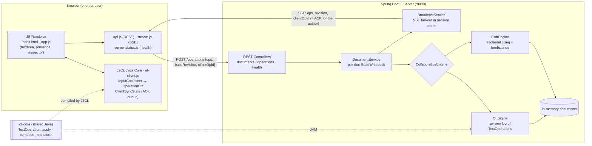
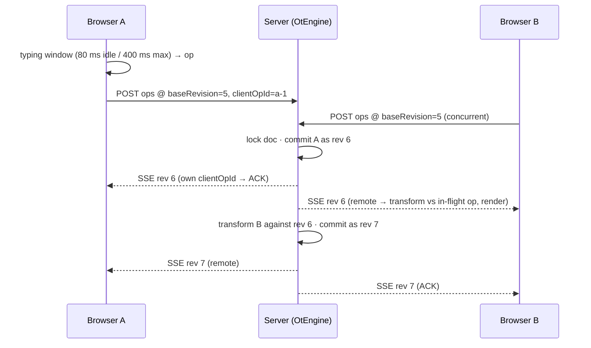

# Collaborative Google Docs Prototype

A Google Docs–style collaborative editor for system design practice: a Spring Boot server with pluggable **OT** and **CRDT** engines, real-time sync over **SSE**, and a browser client whose collaboration core (ACK queue, typing window) is written in **Java and compiled to JS with J2CL**.

Full design, API specs, and current implementation status: [SYSTEM_DESIGN_PLAN.md](SYSTEM_DESIGN_PLAN.md).

---

## 1. Bring Up the Server & Client

There is **no separate client process**. The Spring Boot server serves the browser client as static files, so starting the server starts everything.

### Prerequisites
- JDK 21: `/opt/homebrew/opt/openjdk@21` (on corp Macs the default `java` is blocked by Santa)
- Maven 3.9+

### Start (option A: one command)
```bash
./run-global-demo.sh              # port 8080; use SERVER_PORT=8081 ./run-global-demo.sh to change it
```

### Start (option B: step by step)
Run from this directory (`google-docs/`):
```bash
export JAVA_HOME=/opt/homebrew/opt/openjdk@21

# 1. Install the shared OT library the server depends on (re-run whenever ot-core/ changes)
mvn -B -pl ot-core install -DskipTests

# 2. Start the server (foreground; Ctrl+C stops it)
mvn -B -f server/pom.xml spring-boot:run \
  -Dspring-boot.run.arguments="--server.address=127.0.0.1 --server.port=8080"
```

### Open the client
1. Browse to **http://127.0.0.1:8080/**. A new document is created and the URL changes to `/docs/<docId>`.
2. To collaborate as a **second user**, open that `/docs/<docId>` URL in an **Incognito window**, or in another browser or Chrome profile. Tabs in the same profile share one identity (the `sessionId` in `localStorage`), so they count as the same user.

### Stop / restart
```bash
lsof -ti tcp:8080 -sTCP:LISTEN | xargs kill   # stop (or Ctrl+C in the server terminal)
# restart = stop, then run the start command again
```
- Documents are **in memory only**. A restart wipes them, and old `/docs/<id>` links open a fresh document.
- Open tabs show a **"Server is down"** screen while the server is unreachable, and reload by themselves when it comes back.
- Changes under `server/` (Java or `static/`) take effect after a restart plus a hard reload (`Cmd+Shift+R`).

### Run the tests
```bash
export JAVA_HOME=/opt/homebrew/opt/openjdk@21
mvn -B -pl ot-core install        # shared OT core
mvn -B -f server/pom.xml test     # server engines, end-to-end OT convergence
```

### Share with friends (optional)
```bash
cloudflared tunnel --url http://localhost:8080   # prints a public https://xxxx.trycloudflare.com URL
```

> [!NOTE]
> **Current limitations**
> - The J2CL bundle (`web-client` → `ot-client.js`) can't be built yet: Corp Airlock is missing the `j2cl-maven-plugin` dependencies. Until it can, the browser runs the legacy JS sync path, and a root `mvn install` fails at `web-client`.
> - `docker compose up` is currently broken: the image builds `server/` without `ot-core`.
>
> Details: [SYSTEM_DESIGN_PLAN.md › Implementation status](SYSTEM_DESIGN_PLAN.md#goal-description).

---

## 2. High-Level Architecture



### How an edit flows


- **Server**: accepts concurrent edits and applies them one at a time per document. Any edit based on an older revision is transformed against the newer history. Every commit is broadcast over SSE in revision order.
- **Client**: keeps at most one op in flight and batches later typing into a buffer. Remote ops are transformed through the in-flight op and the buffer, so local keystrokes are never overwritten. This is the Jupiter / Google Wave ACK queue.
- **Shared code**: the server and the browser run the same `transform` from `ot-core`, on the JVM and via J2CL respectively.

---

## Project Layout
```
google-docs/
├── pom.xml              # Maven aggregator: ot-core → web-client → server
├── ot-core/             # Shared OT logic (TextOperation, ACK queue, typing window) + tests
├── web-client/          # J2CL facade (OtClient) → static/js/ot-client.js
├── server/              # Spring Boot app; serves the client from src/main/resources/static/
├── run-global-demo.sh   # Install ot-core, start server, print tunnel instructions
└── SYSTEM_DESIGN_PLAN.md
```
