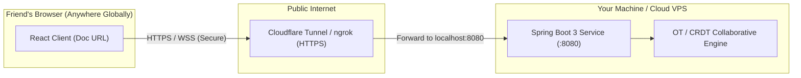

# System Design & Implementation Plan: Google Docs Prototype (OT & CRDT with Global Collaboration)

## Goal Description
Build a functional, production-ready prototype of **Google Docs** in [`google-docs/`](file:///Users/jzchen/SystemDesign/google-docs) designed for system design practice and **live global multi-user collaboration with friends across the internet**.

The system features:
1. **Server (Java - Spring Boot 3 + Maven)**:
   - **Document Creation & Global Sharing**: Initializes documents, provisions unique session tokens with Google Docs-style anonymous identities (e.g., "Anonymous Llama", color-coded avatars), and returns shareable URLs.
   - **Pluggable Concurrency Strategy (`CollaborativeEngine`)**:
     - **Handcrafted OT Engine**: Pure Java implementation with revision log, transformation functions, and offset recalculation.
     - **Handcrafted Sequence CRDT Engine**: Fractional positional indexing (LSeq-style) with tombstones, guaranteeing conflict-free commutativity across high-latency WAN connections.
   - **Real-Time Sync Engine**: Server-Sent Events (SSE) / WebSocket pub-sub stream alongside REST fallback for sub-second edit propagation.
2. **Client (React + Vite + Modern Vanilla CSS)**:
   - Real-time collaborative editor showing live cursor/selection awareness, active peers, and instant sync.
   - **Algorithm Selector & Live Inspector**: Toggle between OT and CRDT; inspect revision history transformations or fractional position trees in real-time.
3. **Global Deployment & Sharing Architecture**:
   - Containerized deployment (`Dockerfile` + `docker-compose.yml`) and **Instant Tunneling** (Cloudflare Tunnel / ngrok) allowing zero-configuration sharing with friends worldwide directly from your machine or cloud VPS.
4. **Hardened Security for Public Internet Exposure**:
   - Rate limiting, bounded payloads (DoS prevention), strict XSS sanitization, CORS configuration, and environment-driven host binding.

---

## Detailed Project Directory Structure

```
/Users/jzchen/SystemDesign/google-docs/
├── README.md                                  # Complete architecture documentation & setup guide
├── docker-compose.yml                         # 1-click launch for full-stack deployment
├── run-global-demo.sh                         # Quick script to launch app + expose via tunnel
│
├── server/                                    # Spring Boot 3 Backend Service
│   ├── pom.xml                                # Maven dependencies (Spring Web, Validation, Security)
│   ├── Dockerfile                             # Multi-stage JDK 21 build
│   └── src/
│       ├── main/
│       │   ├── java/com/googledocs/
│       │   │   ├── GoogleDocsApplication.java # Spring Boot main entrypoint
│       │   │   ├── config/
│       │   │   │   ├── WebSecurityConfig.java # CORS, CSP, security headers, rate limiting
│       │   │   │   └── WebConfig.java         # Static asset forwarding & MVC configuration
│       │   │   ├── controller/
│       │   │   │   ├── DocumentController.java# 3 Core APIs: create, read, session join
│       │   │   │   ├── OperationController.java# Document mutations (insert, delete, replace)
│       │   │   │   ├── SyncStreamController.java# SSE / Real-time stream for global peers
│       │   │   │   └── GlobalExceptionHandler.java# Safe error formatting (no leak of stack traces)
│       │   │   ├── model/
│       │   │   │   ├── Document.java          # Core document entity with thread-safe buffers
│       │   │   │   ├── EngineType.java        # Enum: OT vs CRDT
│       │   │   │   ├── OperationType.java     # Enum: INSERT, DELETE, REPLACE
│       │   │   │   ├── OperationRequest.java  # Client mutation payload
│       │   │   │   ├── OperationResult.java   # Transformation result + new revision
│       │   │   │   ├── CommittedOperation.java# OT revision entry
│       │   │   │   ├── CrdtCharacter.java     # Fractional LSeq position token
│       │   │   │   ├── Session.java           # Peer session (displayName, color, activeStatus)
│       │   │   │   └── DocumentResponse.java  # DTO for client view
│       │   │   └── service/
│       │   │       ├── DocumentService.java   # Document repository & thread-safe coordination
│       │   │       ├── CollaborativeEngine.java# Strategy interface for concurrency algorithms
│       │   │       ├── OtEngine.java          # Handcrafted Operational Transformation
│       │   │       ├── CrdtEngine.java        # Handcrafted Fractional LSeq CRDT
│       │   │       └── BroadcastService.java  # Dispatches new revisions to connected SSE peers
│       │   └── resources/
│       │       └── application.yml            # Config (ports, rate limits, host binding)
│       └── test/
│           └── java/com/googledocs/
│               ├── OtEngineTest.java          # Exhaustive OT matrix unit tests
│               ├── CrdtEngineTest.java        # CRDT commutativity & tombstone tests
│               └── DocumentServiceTest.java   # Multi-threaded concurrent stress test
│
└── client/                                    # React + Vite Frontend Web App
    ├── package.json                           # Dependencies (React, Lucide icons)
    ├── vite.config.js                         # Proxy configuration & production build output
    ├── index.html                             # App shell with Google Fonts (Inter / JetBrains Mono)
    ├── Dockerfile                             # Nginx container for production client hosting
    └── src/
        ├── main.jsx                           # React entrypoint
        ├── App.jsx                            # Router, session coordinator & layout
        ├── index.css                          # Modern design system (tokens, dark/light, glassmorphism)
        ├── components/
        │   ├── Header.jsx                     # Title, shareable link button, engine badge, peer avatars
        │   ├── Editor.jsx                     # Interactive rich text area with selection & cursor sync
        │   ├── PeerPresence.jsx               # Avatars for friends currently viewing/editing
        │   ├── EngineSelector.jsx             # Switch / compare OT vs CRDT
        │   ├── InspectorDrawer.jsx            # Real-time inspection: OT transformation shifts vs CRDT IDs
        │   └── CreateDocumentModal.jsx        # Create new document dialog
        └── services/
            ├── api.js                         # REST API client (create, read, submit operations)
            └── stream.js                      # SSE / real-time event listener for live updates
```

---

## Global Collaboration & WAN Resilience

### How to Try This Out Globally with Friends

To share the prototype with friends worldwide without managing cloud infrastructure or domain DNS:



1. **Option 1: Zero-Install Cloudflare Tunnel (`cloudflared`)**:
   - Run: `cloudflared tunnel --url http://localhost:8080`
   - Gives you a secure, global HTTPS URL: `https://cool-docs-abc.trycloudflare.com`
   - Send `https://cool-docs-abc.trycloudflare.com/docs/<docId>` to your friends. They load it instantly on their laptop or phone.
2. **Option 2: Single-Command Docker Deployment**:
   - `docker compose up --build`
   - Deployable in 3 minutes to any free/cheap cloud container host (Fly.io, Railway, Render, or AWS/GCP).

### Concurrency Across High-Latency WAN

When users collaborate globally across continents (e.g. US to Europe or Asia), network round-trip time (RTT) is 100ms–300ms. In this environment:

1. **OT Resilience**:
   - When User A (US) and User B (Europe) type at the same time, their operations cross in flight.
   - User B's operation arrives with `baseRevision = 5` when the server is already at `revision = 6`.
   - The **OT Engine** dynamically transforms User B's operation indices against User A's committed operation, guaranteeing zero lost keystrokes and an identical final document.
2. **CRDT Resilience**:
   - Because CRDT character IDs are immutable fractional values (e.g. `[1, 5, 2]`), operations are mathematically commutative.
   - Even if packet delivery is delayed or reordered by the internet, the document converges to the exact same text for every user globally.
3. **Peer Presence & Anonymous Identities**:
   - When a friend opens the link, the server assigns a random fun persona (e.g. "Anonymous Panda", "Anonymous Falcon") with a distinctive color badge.
   - Friends can see each other's live presence in the header.

---

## REST & Real-Time API Specifications

### 1. Create Document
- **Endpoint**: `POST /api/documents`
- **Request**:
  ```json
  {
    "title": "Global System Design Notes",
    "engineType": "OT" // or "CRDT"
  }
  ```
- **Response (`201 Created`)**:
  ```json
  {
    "docId": "doc-a1b2-c3d4",
    "url": "/docs/doc-a1b2-c3d4",
    "sessionId": "sess-9876-abcd",
    "user": { "name": "Anonymous Cheetah", "color": "#10b981" },
    "engineType": "OT",
    "revision": 0,
    "content": "",
    "createdAt": "2026-09-28T15:30:00Z"
  }
  ```

### 2. Read Document
- **Endpoint**: `GET /api/documents/{docId}`
- **Headers**: `X-Session-Id: sess-...` (if session exists) or auto-assigns new session on join
- **Response (`200 OK`)**:
  ```json
  {
    "docId": "doc-a1b2-c3d4",
    "title": "Global System Design Notes",
    "engineType": "OT",
    "content": "Collaborative text...",
    "revision": 8,
    "activeUsers": [
      { "sessionId": "sess-1", "name": "Anonymous Cheetah", "color": "#10b981" },
      { "sessionId": "sess-2", "name": "Anonymous Penguin", "color": "#3b82f6" }
    ],
    "updatedAt": "2026-09-28T15:31:00Z"
  }
  ```

### 3. Apply Operation (Mutate)
- **Endpoint**: `POST /api/documents/{docId}/operations`
- **Request**:
  ```json
  {
    "sessionId": "sess-9876-abcd",
    "baseRevision": 8,
    "type": "INSERT",
    "position": 14,
    "text": " distributed"
  }
  ```
- **Response (`200 OK`)**:
  ```json
  {
    "success": true,
    "docId": "doc-a1b2-c3d4",
    "revision": 9,
    "appliedOperation": {
      "type": "INSERT",
      "position": 14,
      "text": " distributed"
    },
    "content": "Collaborative distributed text..."
  }
  ```

### 4. Real-Time Event Stream (SSE)
- **Endpoint**: `GET /api/documents/{docId}/events?sessionId=sess-...`
- **Pushes**:
  - `event: operation` -> `{ revision, operation, content, authorSessionId }`
  - `event: peer_joined` / `peer_left` -> `{ activeUsers }`

---

## Public Internet Security & Hardening

When exposing a service to friends globally over public HTTPS tunnels:
1. **Network Binding Control**:
   - Dev testing: binds strictly to `127.0.0.1` per test requirements.
   - Global demo: binds to `0.0.0.0` or behind a reverse proxy/tunnel when running with `run-global-demo.sh` or Docker.
2. **Rate Limiting & Abuse Prevention**:
   - Token-bucket rate limiting filter on `/api/**` (e.g. max 60 operations/sec per IP/session) to prevent automated flooding.
3. **Payload Clamping & DoS Guards**:
   - Maximum operation text size: 32 KB per request.
   - Maximum document size: 2 MB memory cap.
   - Boundary checks: $0 \le position \le contentLength$, preventing out-of-bounds index exceptions.
4. **XSS Protection**:
   - Untrusted document text rendered strictly through React DOM properties (`value` on `<textarea>` or `textContent` on elements). No `innerHTML` or script execution.
5. **Secure Headers & CSP**:
   - `Content-Security-Policy: default-src 'self'; script-src 'self'; style-src 'self' 'unsafe-inline' https://fonts.googleapis.com; font-src https://fonts.gstatic.com;`
   - `X-Content-Type-Options: nosniff`
   - `X-Frame-Options: SAMEORIGIN`

---

## Verification Plan

### Automated Tests
1. **Unit & Concurrency Tests**:
   - `OtEngineTest`: Multi-client concurrent insertion, deletion, and boundary shifts.
   - `CrdtEngineTest`: Verifies out-of-order operation arrival converges identically.
   - `DocumentServiceTest`: 20 concurrent threads pounding a single document with simultaneous edits.
2. **Security & Boundary Tests**:
   - Rate limit test: excessive rapid requests trigger `429 Too Many Requests`.
   - Payload limit test: oversized payload triggers `413 Payload Too Large`.

### Live Multi-User Global Verification
1. **Local Test**: Verify in two browser windows with separate sessions.
2. **Tunnel Test**:
   - Launch `./run-global-demo.sh`.
   - Open public URL on mobile phone (cellular data, outside local Wi-Fi) and desktop browser.
   - Type simultaneously on both devices to verify live cross-WAN sync and conflict resolution.
