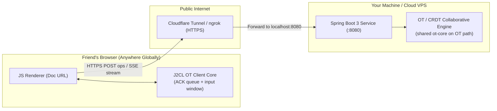

# System Design & Implementation Plan: Google Docs Prototype (OT & CRDT with Global Collaboration)

## Goal Description
Build a functional, production-ready prototype of **Google Docs** in [`google-docs/`](file:///Users/jzchen/SystemDesign/google-docs) designed for system design practice and **live global multi-user collaboration with friends across the internet**.

The system features:
1. **Server (Java - Spring Boot 3 + Maven)**:
   - **Document Creation & Global Sharing**: Initializes documents, provisions unique session tokens with Google Docs-style anonymous identities (e.g., "Anonymous Llama", color-coded avatars), and returns shareable URLs.
   - **Pluggable Concurrency Strategy (`CollaborativeEngine`)**:
     - **Handcrafted OT Engine**: Pure Java implementation with a revision log of `TextOperation`s (retain / insert / delete), using the transformation and composition functions from the shared `ot-core` module.
     - **Handcrafted Sequence CRDT Engine**: Fractional positional indexing (LSeq-style) with tombstones, guaranteeing conflict-free commutativity across high-latency WAN connections.
   - **Real-Time Sync Engine**: A Server-Sent Events (SSE) pub-sub stream, totally ordered by revision, alongside REST mutation and catch-up endpoints for sub-second edit propagation.
2. **Client (Java core compiled with J2CL + Maven, thin vanilla-JS renderer)**:
   - **Java Client Core (`ot-core` + `web-client`, compiled to `ot-client.js` by J2CL)**: holds all critical collaboration logic, sharing the *same* `transform` code as the server:
     - **Input Coalescing Window**: listens to editor change events, batches keystrokes within a short window (80 ms idle / 400 ms max, paused during IME composition), and converts them into one operation that is ready to send.
     - **ACK Queue (Jupiter / Google Wave protocol)**: one operation in flight plus a composed buffer. Remote operations are transformed through both before rendering, so local keystrokes are never overwritten.
   - **JavaScript Renderer**: only DOM rendering (textarea, cursor, peer avatars), timers, `fetch` and the SSE connection.
   - **Algorithm Selector & Live Inspector**: Toggle between OT and CRDT; inspect revision history transformations, fractional position trees, and the live ACK queue state in real-time.
   - **Server Availability Screen**: a full-page "Server is down" screen when the server stops answering, with automatic reload on recovery or restart.
3. **Global Deployment & Sharing Architecture**:
   - Containerized deployment (`Dockerfile` + `docker-compose.yml`) and **Instant Tunneling** (Cloudflare Tunnel / ngrok) allowing zero-configuration sharing with friends worldwide directly from your machine or cloud VPS.
4. **Hardened Security for Public Internet Exposure**:
   - Rate limiting, bounded payloads (DoS prevention), strict XSS sanitization, CORS configuration, and environment-driven host binding.

> [!IMPORTANT]
> **Implementation status (2026-09-29).** The target design above is only partly live. The browser still runs the legacy client path.
>
> | Component | Status |
> |---|---|
> | `ot-core` (`TextOperation`, `OperationDiff`, `InputCoalescer`, `ClientSyncState`) | ✅ Done. 28 JVM tests pass |
> | Server OT engine on `TextOperation`, `ops` + `clientOpId` API, catch-up endpoint | ✅ Done. 13 tests pass (incl. `OtEndToEndTest`) |
> | `web-client` J2CL bundle (`ot-client.js`) | ⛔ Code written, **build blocked**: Corp Airlock lacks `j2cl-maven-plugin` 0.21.0 dependencies (`auto-value:1.6`, `j2cl backend-closure` / `frontend-javac` / `org.eclipse.jdt.core` `0.11.0-9336533b6`, `closure-compiler-unshaded:v20221102-1`). 0.22.0 is not in Airlock at all |
> | JS renderer wired to `OtClient` (ACK queue in the browser) | ⏳ Pending the bundle. `app.js` still sends one single-span op per `input` event and overwrites the textarea with the SSE `content` |
> | Server-down / restart detection (`/api/health` + `server-status.js`) | ✅ Done |
> | Strict CSP | ⏳ Not applied yet (current CSP is permissive, see Security §5) |
> | Docker / docker-compose | ⛔ Broken: still builds `server/` alone, which can't resolve `ot-core` |

---

## Detailed Project Directory Structure

```
/Users/jzchen/SystemDesign/google-docs/
├── README.md                                  # Complete architecture documentation & setup guide
├── pom.xml                                    # Maven aggregator: ot-core -> web-client -> server
├── docker-compose.yml                         # 1-click launch (TODO: build context must move to repo root)
├── run-global-demo.sh                         # Launch app + expose via tunnel (requires ot-core installed in ~/.m2)
├── client/                                    # Stale copy of old static files, unused (to be deleted)
│
├── ot-core/                                   # Shared OT logic: pure Java 11, runs on JVM (server) AND J2CL (browser)
│   ├── pom.xml                                # No deps besides JUnit; attaches sources jar (J2CL compiles from source)
│   └── src/
│       ├── main/java/com/googledocs/ot/
│       │   ├── TextOperation.java             # retain/insert/delete; apply, compose, transform (TP1-safe)
│       │   ├── OperationDiff.java             # (shadowText, editorText) -> TextOperation
│       │   ├── ClientSyncState.java           # Jupiter ACK queue: Synchronized / AwaitingConfirm / AwaitingWithBuffer
│       │   ├── InputCoalescer.java            # Typing window policy (idle 80ms / max 400ms / IME), no timers inside
│       │   └── OtException.java               # Invalid op / base-length mismatch
│       └── test/java/com/googledocs/ot/
│           ├── TextOperationTest.java         # apply / compose / transform cases
│           ├── TransformPropertyTest.java     # Randomized TP1 convergence fuzz
│           ├── ClientSyncStateTest.java       # Multi-client + reordering server simulation
│           ├── InputCoalescerTest.java        # Flush-window rules
│           ├── OperationDiffTest.java         # Keystroke -> operation diff
│           └── RandomOps.java                 # Seeded random TextOperation generator for fuzz tests
│
├── web-client/                                # J2CL (Vertispan j2cl-maven-plugin 0.21.0) -> static/js/ot-client.js [build blocked, see status]
│   ├── pom.xml                                # Depends on ot-core + jsinterop-annotations 2.1.0; ADVANCED_OPTIMIZATIONS
│   └── src/main/java/com/googledocs/client/
│       ├── OtClient.java                      # @JsType facade; JS callbacks are @JsFunction (send / render / resync)
│       └── entry.js                           # goog.module entry point: exports window.OtClient
│
├── server/                                    # Spring Boot 3 Backend Service
│   ├── pom.xml                                # Spring Web, Validation, ot-core (web-client dependency added once it builds)
│   ├── Dockerfile                             # Multi-stage JDK 21 build (TODO: build full reactor from repo root)
│   └── src/
│       ├── main/
│       │   ├── java/com/googledocs/
│       │   │   ├── GoogleDocsApplication.java # Spring Boot main entrypoint
│       │   │   ├── config/
│       │   │   │   ├── WebSecurityConfig.java # CORS, security headers (CSP still permissive), rate limiting
│       │   │   │   └── WebConfig.java         # Static assets; non-/api paths fall back to index.html
│       │   │   ├── controller/
│       │   │   │   ├── DocumentController.java# 3 Core APIs: create, read, session join
│       │   │   │   ├── OperationController.java# Document mutations (TextOperation or legacy insert/delete/replace) + catch-up
│       │   │   │   ├── SyncStreamController.java# SSE / Real-time stream for global peers
│       │   │   │   ├── HealthController.java  # GET /api/health: liveness + per-boot id (restart detection)
│       │   │   │   └── GlobalExceptionHandler.java# Safe error formatting (no leak of stack traces)
│       │   │   ├── model/
│       │   │   │   ├── Document.java          # Core document entity with thread-safe buffers
│       │   │   │   ├── EngineType.java        # Enum: OT vs CRDT
│       │   │   │   ├── OperationType.java     # Enum: INSERT, DELETE, REPLACE (legacy / CRDT path)
│       │   │   │   ├── OperationRequest.java  # Client mutation payload (ops + clientOpId, or legacy fields)
│       │   │   │   ├── OperationResult.java   # Transformation result + new revision + ops + clientOpId
│       │   │   │   ├── CommittedOperation.java# OT revision entry (stores TextOperation)
│       │   │   │   ├── CrdtCharacter.java     # Fractional LSeq position token
│       │   │   │   ├── Session.java           # Peer session (displayName, color, activeStatus)
│       │   │   │   └── DocumentResponse.java  # DTO for client view
│       │   │   └── service/
│       │   │       ├── DocumentService.java   # Document repository & thread-safe coordination (broadcast under write lock)
│       │   │       ├── CollaborativeEngine.java# Strategy interface for concurrency algorithms
│       │   │       ├── OtEngine.java          # OT revision log; transforms via shared ot-core TextOperation
│       │   │       ├── CrdtEngine.java        # Handcrafted Fractional LSeq CRDT
│       │   │       └── BroadcastService.java  # Revision-ordered ops to SSE peers (still includes full content for legacy client)
│       │   └── resources/
│       │       ├── application.yml            # Config (ports, rate limits, host binding)
│       │       └── static/                    # Thin JS renderer: DOM, timers, network I/O only
│       │           ├── index.html             # App shell; loads js/ot-client.js, server-status.js, api.js, stream.js, app.js (no inline scripts)
│       │           ├── index.css              # Modern design system (tokens, dark/light, glassmorphism)
│       │           ├── app.js                 # Editor events, presence, Inspector (still legacy sync path until OtClient ships)
│       │           ├── api.js                 # REST client (create, read, POST ops + clientOpId, catch-up); reports network errors
│       │           ├── stream.js              # SSE listener with 3 s auto-reconnect; reports errors to server-status.js
│       │           └── server-status.js       # Health polling, "Server is down" screen, reload on recovery / restart
│       └── test/
│           └── java/com/googledocs/
│               ├── OtEngineTest.java          # OT engine via shared ot-core (legacy + TextOperation requests)
│               ├── OtEndToEndTest.java        # 2 ClientSyncState clients + real DocumentService converge (50 seeds)
│               ├── CrdtEngineTest.java        # CRDT commutativity & tombstone tests
│               └── DocumentServiceTest.java   # Create/read + 10-thread concurrent insert test
```

> Once it builds, the J2CL bundle `static/js/ot-client.js` is packaged inside the `web-client` jar. Spring serves it from `classpath:/static/` alongside the renderer files, so the server needs no extra config. Until then, `/js/ot-client.js` falls back to `index.html` and the browser refuses to execute it (`nosniff`), which is harmless.

---

## Global Collaboration & WAN Resilience

### How to Try This Out Globally with Friends

To share the prototype with friends worldwide without managing cloud infrastructure or domain DNS:



1. **Option 1: Zero-Install Cloudflare Tunnel (`cloudflared`)**:
   - Run: `cloudflared tunnel --url http://localhost:8080`
   - Gives you a secure, global HTTPS URL: `https://cool-docs-abc.trycloudflare.com`
   - Send `https://cool-docs-abc.trycloudflare.com/docs/<docId>` to your friends. They load it instantly on their laptop or phone.
   - Local run (until the root reactor build works): `mvn -pl ot-core install -DskipTests`, then `mvn -f server/pom.xml spring-boot:run`.
2. **Option 2: Single-Command Docker Deployment**:
   - `docker compose up --build`
   - Deployable in 3 minutes to any free/cheap cloud container host (Fly.io, Railway, Render, or AWS/GCP).
   - *Currently broken*: the image builds `server/` alone and can't resolve `ot-core`. The build context must move to the repo root.

### Concurrency Across High-Latency WAN

When users collaborate globally across continents (e.g. US to Europe or Asia), network round-trip time (RTT) is 100ms–300ms. In this environment:

1. **OT Resilience (Shared `TextOperation` Model)**:
   - When User A (US) and User B (Europe) type at the same time, their operations cross in flight.
   - User B's operation arrives with `baseRevision = 5` when the server is already at `revision = 6`.
   - The **OT Engine** transforms User B's operation against User A's committed operation, guaranteeing zero lost keystrokes and an identical final document.
   - **Operation model**: every OT operation is a `TextOperation`, a list of `retain(n)` / `insert(s)` / `delete(n)` components that walks the whole document once (the model used by Google Wave and `ot.js`). The earlier single-span `INSERT`/`DELETE`/`REPLACE` model can't satisfy **TP1** (convergence) once clients also transform. Example: an insert inside a concurrently deleted range survives or is swallowed depending on arrival order. `TextOperation` lets the delete split around the insert, and makes `transform` and `compose` total.
   - **One implementation, two runtimes**: `transform(a, b)` lives in the shared `ot-core` Java module. The server runs it on the JVM, and the browser runs the *same* code compiled to JS by **J2CL**. The client op is always the first operand, so tie-breaks (two inserts at the same index) resolve identically on both sides without comparing session IDs.
   - **Server serialization**: each document has a `ReentrantReadWriteLock`. Concurrent requests are all accepted; they are applied one at a time under the write lock, each transformed against `history[baseRevision..current)`. Verified live with 20 concurrent stale-base (`baseRevision = 0`) requests: all returned `200`, SSE delivered revisions 1–20 in order, and every insert was present exactly once.
   - *Known limitation*: the SSE broadcast runs while the write lock is held (to keep SSE order == revision order), and `SseEmitter.send` is blocking I/O. One slow reader therefore delays every writer on that document, and waiting requests hold Tomcat threads (`TODO(perf)`: commit under the lock, then fan out via a per-document ordered queue with bounded per-connection buffers; slow consumers are dropped and catch up via `?sinceRevision=`). The document-size check also runs before the lock is taken, so two concurrent large inserts can slightly exceed the cap.
2. **Client ACK Queue (Jupiter / Google Wave Protocol)**:
   - This is the industry-standard OT client protocol (Jupiter, 1995; used by Google Docs, Google Wave, `ot.js`, ShareDB, Etherpad). The client (`ClientSyncState` in `ot-core`) keeps **at most one operation in flight**, and composes all later local edits into a single **buffer**:
     ```mermaid
     stateDiagram-v2
         [*] --> Synchronized
         Synchronized --> AwaitingConfirm: local op A / send(A)
         AwaitingConfirm --> AwaitingWithBuffer: local op B / buffer = B
         AwaitingWithBuffer --> AwaitingWithBuffer: local op C / buffer = compose(buffer, C)
         AwaitingConfirm --> Synchronized: ACK(A)
         AwaitingWithBuffer --> AwaitingConfirm: ACK(A) / send(buffer)
         Synchronized --> Synchronized: remote R / apply(R)
         AwaitingConfirm --> AwaitingConfirm: remote R / transform vs A, apply(R')
         AwaitingWithBuffer --> AwaitingWithBuffer: remote R / transform vs A then buffer, apply(R'')
     ```
   - **Merging the ACK queue with a server update**: a remote op `R` (based on server state `S`) is transformed through the unacknowledged work before it is rendered:
     ```
     (A', R')  = transform(inflight A, R)    // R' is now based on S∘A
     (B', R'') = transform(buffer B,  R')    // R'' is based on S∘A∘B = what the user sees
     render R'' ; inflight := A' ; buffer := B'
     ```
   - **ACK = SSE echo**: the server broadcasts every committed op while holding the document write lock, so the SSE stream is totally ordered by revision. The client processes events strictly in revision order (a reorder buffer of up to 256 events absorbs any out-of-order delivery). An event carrying its own `authorSessionId` + in-flight `clientOpId` is the ACK; the client then sends the buffer with `baseRevision = revision`. Everything else is a remote op.
   - **Failure handling**: an HTTP error on send, a revision gap that exceeds the reorder buffer, or a `contentLength` mismatch triggers a **resync**: the client reloads the snapshot. Unsent local edits are currently discarded on resync (`TODO`: re-diff them on top of the new snapshot). After an SSE reconnect, the client fetches `?sinceRevision=` to catch up. Each `OtClient` instance uses a unique `clientOpId` prefix so ids never collide across resyncs.
   - *Status*: implemented and tested on the JVM (`ClientSyncStateTest`, `OtEndToEndTest`). It reaches the browser only once the J2CL bundle builds. Until then `app.js` uses the legacy path, which overwrites the textarea with the server's `content` on every remote op, so keystrokes typed during a round trip can be lost.
   - *Scope*: the ACK queue runs for OT documents. CRDT documents keep a simple one-op-in-flight path (`TODO(crdt-client)`), since CRDT position IDs make them order-independent anyway.
3. **Input Coalescing Window (Keystroke → Operation)**:
   - The JS renderer forwards every `input` event to the J2CL client (`InputCoalescer` + `OperationDiff`). Instead of one request per keystroke, edits are batched into one `TextOperation` and flushed when:
     - **Idle**: no keystroke for **80 ms**, or
     - **Max window**: **400 ms** of continuous typing have passed, or
     - **Forced**: immediately before a remote op is applied (so transforms always see the exact local state), and on editor blur.
   - Flushes never happen during IME composition (`compositionstart` … `compositionend`), so partial characters are never sent.
   - On flush: `op = diff(shadowText, editorText)` → `ClientSyncState.applyLocal(op)`. While an op is in flight, flushed ops are composed into the buffer, so a whole RTT of typing becomes one request.
   - *Status*: implemented in `ot-core` (`InputCoalescerTest`); the browser-side timers are wired together with `OtClient`.
4. **CRDT Resilience**:
   - Because CRDT character IDs are immutable fractional values (e.g. `[1, 5, 2]`), operations are mathematically commutative.
   - Even if packet delivery is delayed or reordered by the internet, the document converges to the exact same text for every user globally.
5. **Peer Presence & Anonymous Identities**:
   - When a friend opens the link, the server assigns a random fun persona (e.g. "Anonymous Panda", "Anonymous Falcon") with a distinctive color badge.
   - Friends can see each other's live presence in the header, and the Concurrency Inspector shows the local sync state (`Synchronized` / `AwaitingConfirm` / `AwaitingWithBuffer`).
   - Identity = the `sessionId` stored in `localStorage` (`google_docs_session_id`), shared by all tabs of one browser profile on one origin. To test as a second user, use an Incognito window, another browser/profile, or the other host name (`localhost` vs `127.0.0.1`).
6. **Server Outage & Restart Detection**:
   - Documents live only in server memory, so a restart loses them. `server-status.js` polls `GET /api/health` (every 15 s while up, every 3 s while down, 3 s timeout); SSE errors and failed `fetch` calls trigger an immediate check.
   - After 2 consecutive failures it shows a full-page **"Server is down"** screen, blurs the editor and blocks input (edits could not be saved).
   - On recovery, or if the health response carries a different `bootId` (a restart between polls), the page reloads. The old `docId` then returns `404`, and the client creates a fresh document.
   - This only covers tabs that are already open; a fresh navigation while the server is down shows the browser's own error page (a service-worker offline page would be needed for that).

---

## REST & Real-Time API Specifications

### 1. Create Document
- **Endpoint**: `POST /api/documents`
- **Request**:
  ```json
  {
    "title": "Global System Design Notes",
    "engineType": "OT" // or "CRDT"
  }
  ```
- **Response (`201 Created`)**:
  ```json
  {
    "docId": "doc-a1b2-c3d4",
    "url": "/docs/doc-a1b2-c3d4",
    "sessionId": "sess-9876-abcd",
    "user": { "name": "Anonymous Cheetah", "color": "#10b981" },
    "engineType": "OT",
    "revision": 0,
    "content": "",
    "createdAt": "2026-09-28T15:30:00Z"
  }
  ```

### 2. Read Document
- **Endpoint**: `GET /api/documents/{docId}`
- **Headers**: `X-Session-Id: sess-...` (if session exists) or auto-assigns new session on join
- **Response (`200 OK`)**:
  ```json
  {
    "docId": "doc-a1b2-c3d4",
    "title": "Global System Design Notes",
    "engineType": "OT",
    "content": "Collaborative text...",
    "revision": 8,
    "activeUsers": [
      { "sessionId": "sess-1", "name": "Anonymous Cheetah", "color": "#10b981" },
      { "sessionId": "sess-2", "name": "Anonymous Penguin", "color": "#3b82f6" }
    ],
    "updatedAt": "2026-09-28T15:31:00Z"
  }
  ```
- **Errors**: `404` if the document doesn't exist (e.g. after a server restart).

### 3. Apply Operation (Mutate)
- **Endpoint**: `POST /api/documents/{docId}/operations`
- **Request** (OT documents, sent by the J2CL client's ACK queue):
  ```json
  {
    "sessionId": "sess-9876-abcd",
    "clientOpId": "c-17",
    "baseRevision": 8,
    "ops": [14, " distributed", 16]
  }
  ```
  - `ops` is a `TextOperation` in compact form that spans the whole document: a positive int is `retain(n)`, a string is `insert(s)`, a negative int is `delete(n)`. Example: `[6, -5, "Brave", 5]` replaces 5 chars at index 6.
  - `clientOpId` is unique per client op; the client uses it to recognize its own ACK on the SSE stream.
  - **Legacy form (still accepted, converted server-side; used today by the browser, by CRDT documents and by `curl`)**: `{ "sessionId", "baseRevision", "type": "INSERT|DELETE|REPLACE", "position", "text", "length" }`.
  - `ops` on a CRDT document, or a request with neither `ops` nor `type`, is rejected with `400`.
- **Response (`200 OK`)**: only confirms receipt. **The authoritative ACK is the SSE echo** (see 4), because SSE is the only channel that is totally ordered by revision. The full document `content` is not included.
  ```json
  {
    "success": true,
    "docId": "doc-a1b2-c3d4",
    "revision": 9,
    "clientOpId": "c-17",
    "ops": [14, " distributed", 16],
    "contentLength": 42,
    "debugInfo": { "engine": "OT", "baseRevision": 8, "committedRevision": 9, "transformationsApplied": 0, "transformTrace": [] }
  }
  ```
- **Errors**: `400` if `baseRevision > currentRevision`, the op's `baseLength` doesn't match the document after transformation, or the component or `clientOpId` validation fails; `413` if the document would exceed its size cap; `429` when rate-limited. The client then resyncs from a snapshot.

### 4. Real-Time Event Stream (SSE)
- **Endpoint**: `GET /api/documents/{docId}/events?sessionId=sess-...`
- **Pushes** (broadcast while holding the document write lock, so event order == revision order):
  - `event: connected` -> `{ docId, sessionId, message }` (sent on every (re)connect; the client uses it to trigger catch-up)
  - `event: operation` -> `{ docId, revision, engineType, ops, clientOpId, authorSessionId, contentLength, debugInfo, type, position, text, length, content }`
    - `ops` / `clientOpId` / `contentLength` serve the ACK queue: the client checks `contentLength` after applying the op and resyncs on mismatch.
    - `type` / `position` / `text` / `length` / `content` are still sent for the legacy client. `TODO(j2cl-client)`: stop sending full `content` for OT documents once every client applies ops.
  - `event: presence` -> `{ activeUsers }`
- **Catch-up after reconnect**: `GET /api/documents/{docId}/operations?sinceRevision=N` returns the committed ops `> N` (`revision`, `sessionId`, `clientOpId`, `ops`, plus legacy fields), which the client feeds into the same ordered pipeline (duplicates are dropped by revision).

### 5. Health Check
- **Endpoint**: `GET /api/health`
- **Response (`200 OK`, `Cache-Control: no-store`)**:
  ```json
  { "status": "UP", "bootId": "72b6957e-dc48-478c-b082-99351d62febb" }
  ```
  - `bootId` is random per JVM start and carries no document data; a change means the server restarted and all in-memory documents are gone.

---

## Public Internet Security & Hardening

When exposing a service to friends globally over public HTTPS tunnels:
1. **Network Binding Control**:
   - Dev testing: binds strictly to `127.0.0.1` (`SERVER_HOST` default in `application.yml`).
   - Global demo: binds to `0.0.0.0` or behind a reverse proxy/tunnel when running with `run-global-demo.sh` or Docker.
2. **Rate Limiting & Abuse Prevention**:
   - Token-bucket rate limiting filter on `/api/**`: **600 requests/minute** per client IP (+ `X-Session-Id` when present), configurable via `app.rate-limit.requests-per-minute`. Exceeding it returns `429`.
   - Health polling costs 4 requests/minute while up and 20/minute while down, well under the limit.
3. **Payload Clamping & DoS Guards**:
   - Maximum operation text size: 32 KB per request (total inserted characters across all `ops` components).
   - Maximum op complexity: 4096 components per `TextOperation`; `clientOpId` must match `[A-Za-z0-9-]{1,64}`.
   - Maximum document size: 2 MB (2,097,152 characters, `app.document.max-length`).
   - Boundary checks: $0 \le baseRevision \le currentRevision$. After transformation, the op's `baseLength` must equal the current document length, otherwise it is rejected with `400` before it touches the buffer (replaces the old $0 \le position \le contentLength$ clamp).
   - The client input coalescing window and the one-in-flight ACK queue *reduce* request volume. The client's out-of-order revision buffer is capped and falls back to a snapshot resync.
4. **XSS Protection**:
   - Untrusted document text reaches the DOM only through `textarea.value` (remote ops are applied to the string, never as HTML) and `textContent` (Inspector feed, presence avatars, server-down screen). No `innerHTML`, `outerHTML`, `insertAdjacentHTML`, `document.write` or script execution.
   - The J2CL client core never touches the DOM; it exchanges plain strings and numbers with the JS renderer.
5. **Secure Headers & CSP**:
   - **Current** (`WebSecurityConfig`): `Content-Security-Policy: default-src 'self' 'unsafe-inline' https: http:; img-src 'self' data: https:; font-src 'self' https://fonts.gstatic.com;`, plus `X-Content-Type-Options: nosniff` and `X-Frame-Options: SAMEORIGIN`.
   - **Target** (`TODO(security)`): all scripts (`ot-client.js`, `server-status.js`, `api.js`, `stream.js`, `app.js`) are external same-origin files, so the CSP can forbid inline scripts:
     `Content-Security-Policy: default-src 'self'; script-src 'self'; style-src 'self' 'unsafe-inline' https://fonts.googleapis.com; font-src 'self' https://fonts.gstatic.com; img-src 'self' data:; connect-src 'self'; object-src 'none'; frame-ancestors 'self';`
6. **Known Gaps (tracked as `TODO(security)`)**:
   - The CSP above is still permissive (allows inline scripts and any `http:`/`https:` source).
   - The session ID lives in `localStorage`; moving it to an `HttpOnly` cookie requires adding CSRF tokens.
   - No authentication or authorization on documents: anyone with the link can edit, by design of the demo.
   - `docker-compose.yml` sets `CORS_ALLOWED_ORIGINS=*` while CORS allows credentials; CORS also allows unused methods (`PUT`, `DELETE`, `PATCH`).
   - Missing static assets fall back to `index.html` with `200 text/html` instead of `404`.
   - When an SSE connection times out or errors, `GlobalExceptionHandler` tries to write a JSON body onto the already-started `text/event-stream` response ("No converter for HashMap"). It's harmless, but it floods the logs.

---

## Verification Plan

### Automated Tests
Target: `mvn test` from the repo root (full reactor: `ot-core` → `web-client` → `server`). **Currently fails at `web-client`** (Airlock), so run the modules that build:

```bash
export JAVA_HOME=/opt/homebrew/opt/openjdk@21
mvn -B -pl ot-core install          # 28 tests
mvn -B -f server/pom.xml test       # 13 tests
```

1. **Shared OT Core Tests (`ot-core`, run on the JVM)**: ✅ passing
   - `TextOperationTest`: apply / compose / transform unit cases, including *insert inside a concurrent delete* (the insert survives and the delete splits around it).
   - `TransformPropertyTest`: randomized, seeded **TP1 fuzz** over 10,000 op pairs: `apply(apply(S,a),b') == apply(apply(S,b),a')`, and compose matches sequential apply.
   - `ClientSyncStateTest`: two simulated clients plus an in-memory server with random delay and reordering (200 seeds); asserts every ACK queue transition and final convergence.
   - `InputCoalescerTest` / `OperationDiffTest`: idle / max-window / IME flush rules and the keystroke → operation diff.
2. **J2CL Build Check (`web-client`)**: ⛔ blocked
   - `mvn -pl ot-core,web-client install` should produce `static/js/ot-client.js`, and `window.OtClient` (with `onServerEvent` etc.) must survive `ADVANCED_OPTIMIZATIONS`. Blocked until Airlock provides the plugin dependencies listed in the status table.
3. **Server Unit & Concurrency Tests**: ✅ passing
   - `OtEngineTest`: multi-client concurrent insertion, deletion and boundary shifts (legacy single-span requests), plus rejection of `baseLength` mismatches and `baseRevision > current`.
   - `OtEndToEndTest`: two `ClientSyncState` instances wired to a real `DocumentService` through a reordering fake transport; after random edits (50 seeds), both clients' text equals the server content.
   - `CrdtEngineTest`: verifies that out-of-order operation arrival converges identically.
   - `DocumentServiceTest`: create/read, and 10 concurrent threads inserting into one document; all succeed and the final length is 10. (SSE ordering under concurrency is covered by the live smoke test below.)
4. **Security & Boundary Tests** (manual `curl` against `127.0.0.1`; not yet automated):
   - ✅ Verified: `ops` whose length doesn't match the document → `400`; `baseRevision` ahead of the server → `400`; `clientOpId` of `<script>` → `400`; legacy request form → `200`; catch-up returns `ops`.
   - Rate limit: excessive rapid requests trigger `429 Too Many Requests`.
   - Payload limit: an oversized payload triggers `413 Payload Too Large`; more than 4096 op components triggers `400`.
   - Header check: `curl -I` shows `nosniff` and `X-Frame-Options` ✅; strict CSP ⏳ (not applied yet).

### Live Multi-User Global Verification
1. **Local Test**: two browser windows with separate sessions (Incognito for the second), server bound to `127.0.0.1`.
   - ✅ **Concurrency smoke test (HTTP)**: 20 concurrent `ops` requests from 2 sessions, all at `baseRevision = 0`, plus one SSE listener: 20× `200`, SSE revisions 1–20 in order, final revision 20, all 20 inserts present exactly once.
   - ⏳ **Server-down screen** (endpoint and assets verified with `curl`; browser check pending): stop the server (`lsof -ti tcp:8081 -sTCP:LISTEN | xargs kill`); the open tab should show "Server is down" within a few seconds. Restart it; the tab should show "Server is back" and reload onto a new document.
   - ⏳ (needs the J2CL bundle) Type rapidly at the same spot and across overlapping delete ranges in both windows: the text ends up identical, with no lost keystrokes and no flicker.
   - ⏳ Throttle one window (DevTools → Slow 3G): the Inspector sync badge cycles `AwaitingConfirm` → `AwaitingWithBuffer` → `Synchronized`, and the request count drops because keystrokes are coalesced.
   - ⏳ Toggle offline for 5 s: after the SSE stream reconnects, catch-up via `?sinceRevision=` restores convergence.
   - ⏳ Type with an IME (e.g. Pinyin): no partial composition ops are sent.
2. **Tunnel Test**:
   - Launch `./run-global-demo.sh` (after `mvn -pl ot-core install`).
   - Open the public URL on a mobile phone (cellular data, outside local Wi-Fi) and in a desktop browser.
   - Type simultaneously on both devices to verify live cross-WAN sync and conflict resolution.
